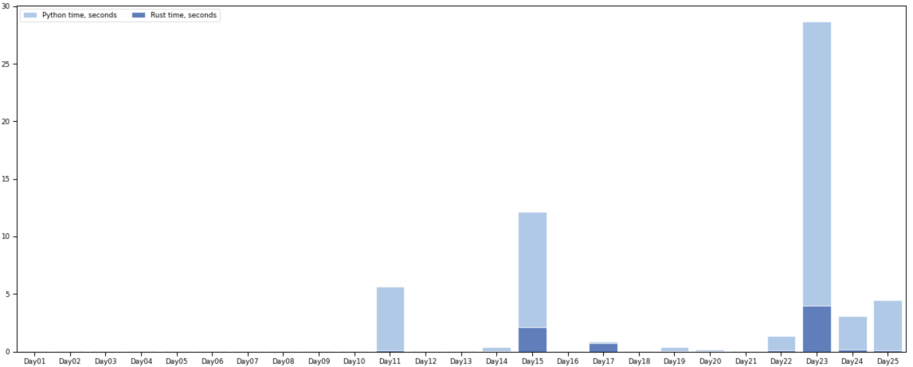
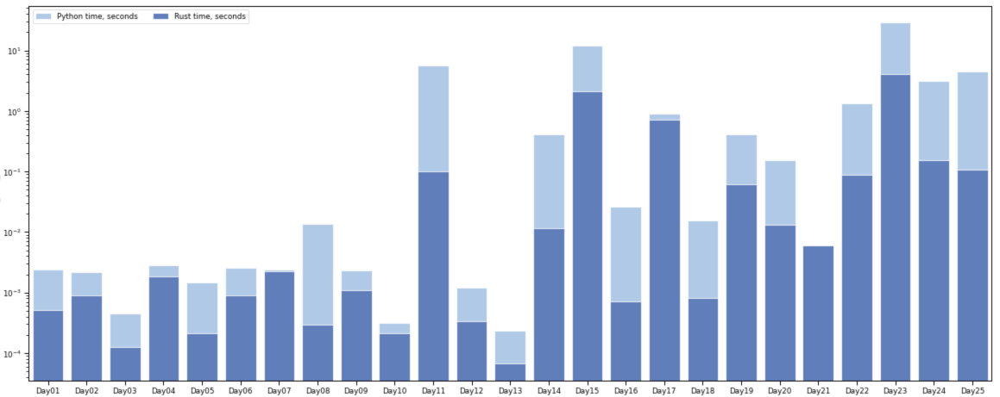
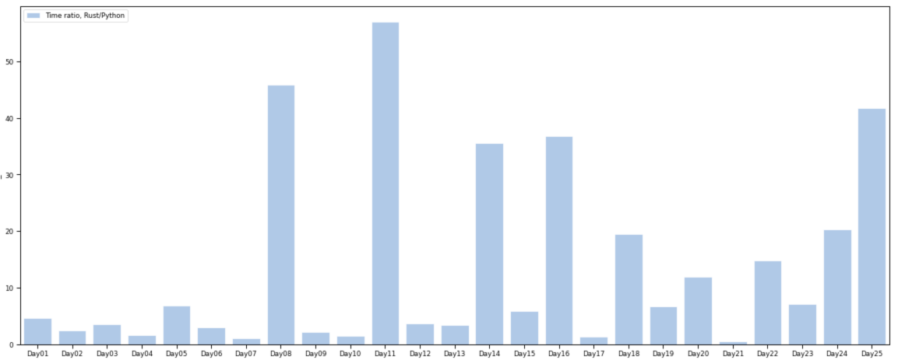

This is a repo of my solutions (both Python and Rust) for [Advent of Code 2020](https://adventofcode.com/2020/about).

### Self-imposed constraints
This makes things more interesting, e.g. some previous years I've done each day in a different language ([2016](https://github.com/rshest/advent-2016) and [2017](https://github.com/rshest/advent-2017)).

This year the "constraints" were:
* Solve every problem on the day it's released (but starting time doesn't matter)
* No checking Internet before solved (treat it as a "job interview")
* Do it in two very different languages: Python (ideal for problem solving) and Rust (ideal for speed and safety, but primarily as a learning experience)
* Use the same algorithm for implementations in both languages, so it's more or less apples to apples
* Initial solutions were made in Jupyter lab (see the [notebooks](notebooks) folder), then factored into a folder structure after Day 25

### Running

Rust:
```
$ cd rust && cargo run --release
```

Python:
```
$ cd python && python3 main.py
```

### Some random stats

Total execution time: 
* Rust: **7.6s**
* Python: 57.26s (~7.5x)

Total lines count: 
* Python: **1549**
* Rust: 2418 (~1.6x)

Rust is on average 13x "faster".

Timings per day, seconds:


Log scale:


Timing ratio, Rust/Python:

